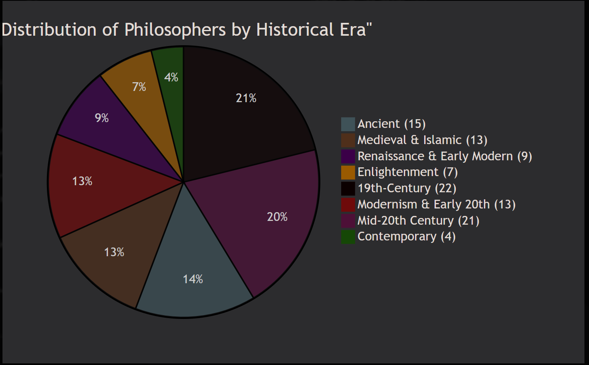
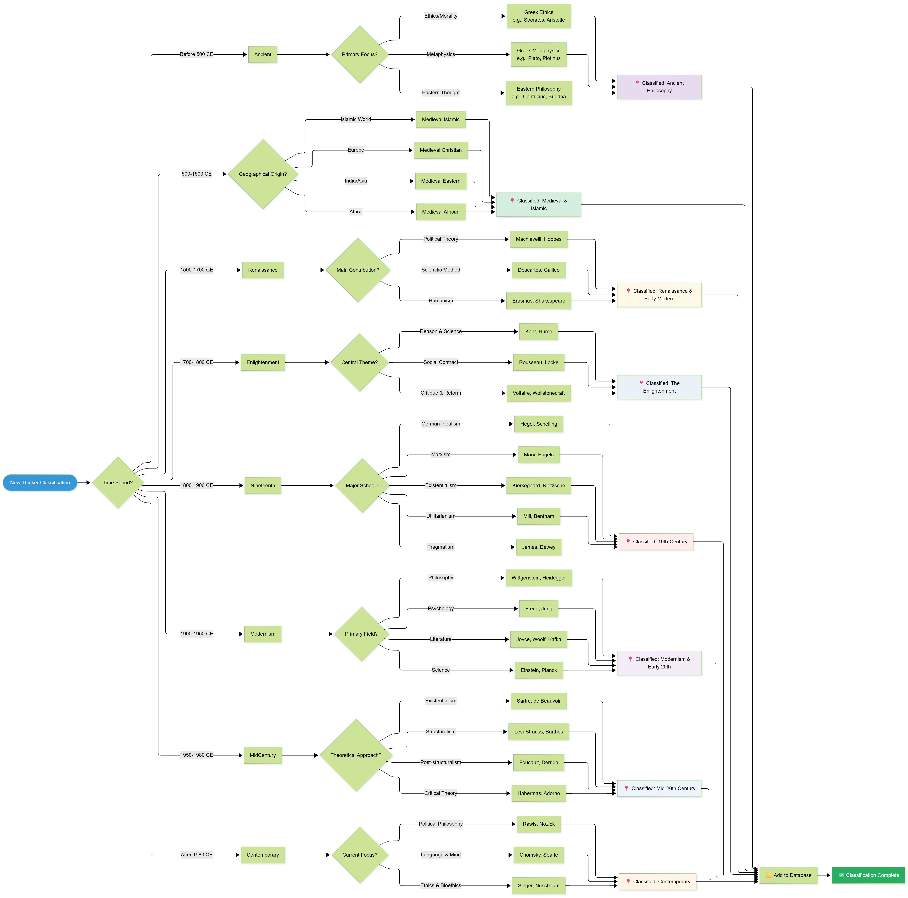
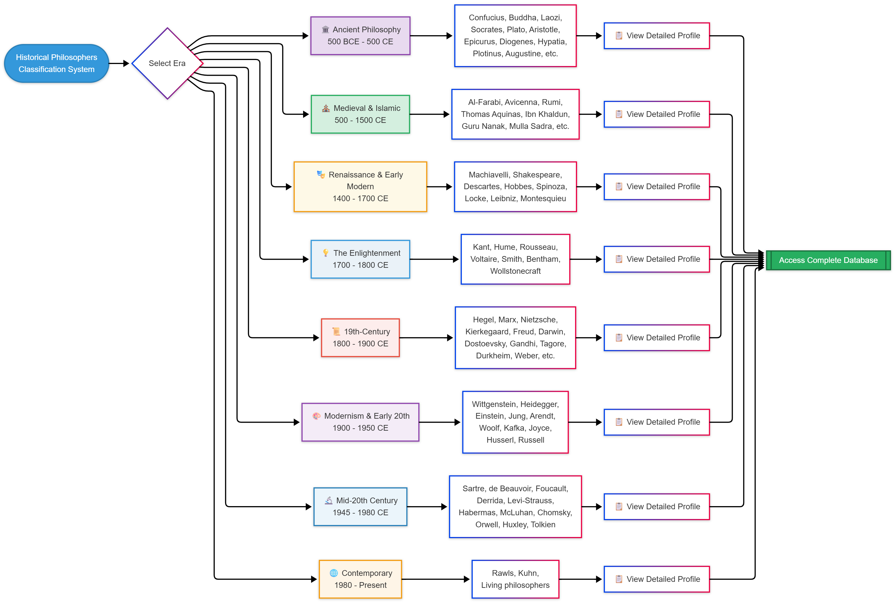
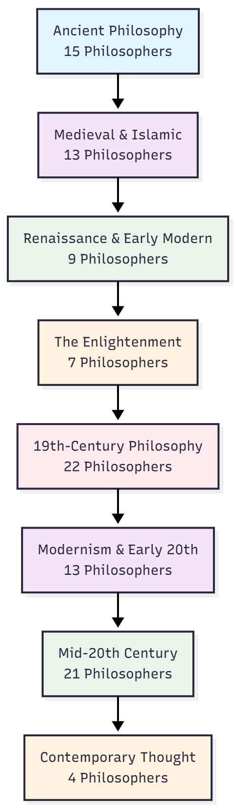

# Historical Philosophers Database

## Structure

The database is organized into 8 main historical eras:

1. **Ancient Philosophy** - Foundational thinkers from ancient civilizations
2. **Medieval & Islamic Philosophy** - Scholastic, Islamic, and medieval thinkers  
3. **Renaissance & Early Modern Philosophy** - Transition from medieval to modern thought
4. **The Enlightenment** - Age of Reason and philosophical revolution
5. **19th-Century Philosophy** - Idealism, Marxism, existentialism, and more
6. **Modernism & Early 20th-Century Thought** - Responses to modernity and world wars
7. **Mid-20th Century Philosophical Schools** - Structuralism, existentialism, critical theory
8. **Contemporary Thought** - Living and recent influential thinkers

## How to Use

Each philosopher has their own folder containing:
- `profile.md` - Markdown file with biographical and philosophical information
- Additional resources can be added as needed

## Statistics

| Era | Number of Philosophers |
|-----|-----------------------|
| Ancient Philosophy | 15 |
| Medieval & Islamic Philosophy | 13 |
| Renaissance & Early Modern Philosophy | 9 |
| The Enlightenment | 7 |
| 19th-Century Philosophy | 22 |
| Modernism & Early 20th-Century Thought | 13 |
| Mid-20th Century Philosophical Schools | 21 |
| Contemporary Thought | 4 |

## Contributing

To add a new philosopher:
1. Create a folder in the appropriate era directory
2. Name it in the format: `FirstName LastName (Alternative Names)`
3. Create a `profile.md` file using the template

## Notes

- All names are in English using commonly accepted scholarly conventions
- Dates follow the Gregorian calendar where applicable
- Philosophical schools and movements are indicated in each profile

---
*This database was automatically generated using Python*
